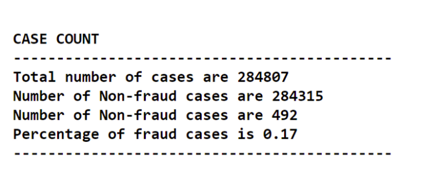
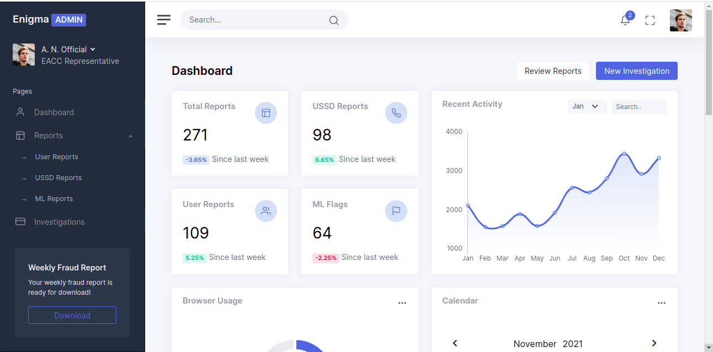
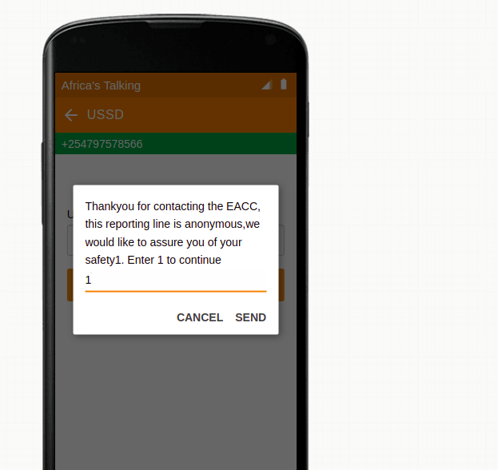
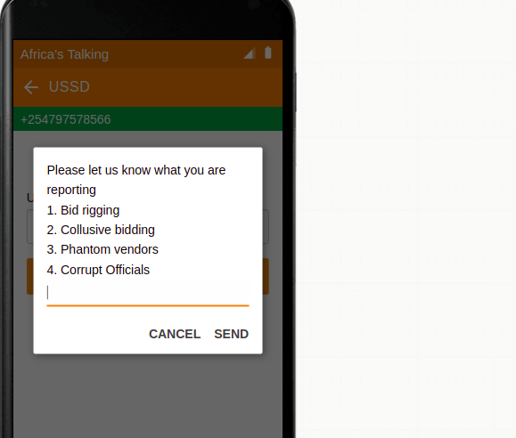
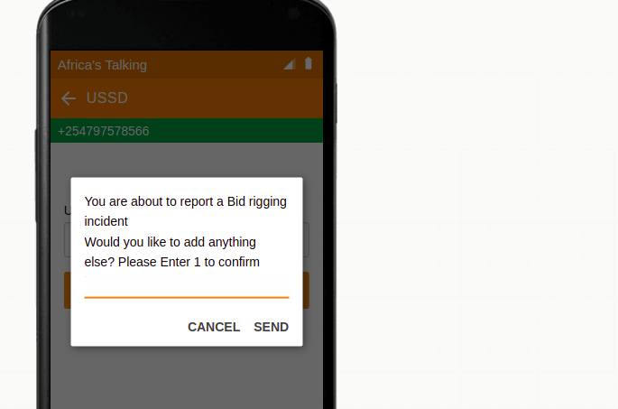
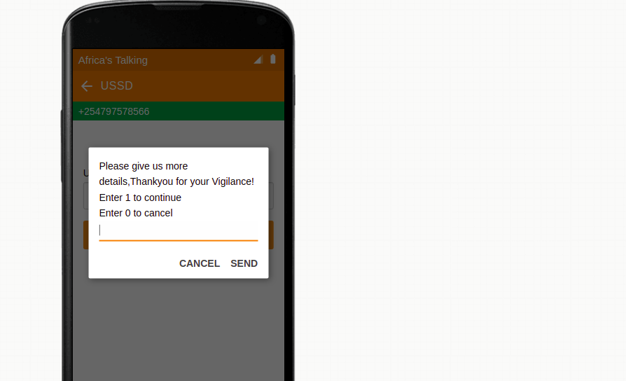
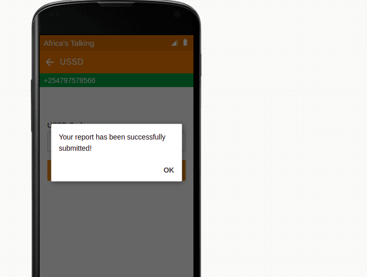

# About our Project
Our company Enigma, is developing an accurate and affordable fraud detection and whistleblowing system that will help Anti Corruption Agencies and relevant authorities, investigate fraud seamlessly while ensuring that the general public is able to report fraud safely and anonymously.

This project uses technology to fight corruption within our African Countries, specifically Kenya.
We will be using machine learning and other software tools to detect fraudulent activities within the public procurement system while allowing the public to anonymously report any fraud.

# **How the system works** #
This system is designed for 2 end users:
  1. Anticorruption Agency [for speedy investigations and for easy collaboration between authorities]
  2. The general public [for use in anonymous whistleblowing]
  
Ideally, the fraud detection model will be deployed at Treasury for use in the IFMIS system.
We have trained the model to be able to detect fraud, using data that has various features such as:
 1. Time taken between transactions (usually fraud takes place when many transactions are done together)
 2. The nature of the transaction
 3. The amount of transaction.
 4. Other features as will be informed to constitute 'fraud'.

 
For contractor bidding, the below metrics have been used.

 1. Bid price (if the bid is too low, then it should be flagged
 2. Time taken to present the bid
 3. Other features as will be informed to constitute 'fraud'.
 
Once fraud is detected, the system automatically flags these transactions and alerts sent automatically to 3 independent parties.
For example: if fraud occurs within the Kenya Revenue Authority, then the alerts are sent to:
 1. An officer in the Anticorruption Office (EACC)
 2. An officer in Kenya Revenue Authority (KRA)
 3. An officer at the Director for Public Prosecutions (DPP)

# **Dashboard** #
An Officer at the Anticorruption Agency is able to view a dashboard that has 4 items;
1. Fraud alerts from whichever office
2. SMS alerts
3. Website reports received through the website.
4. Details of the reports

# **USSD Functionality** #

**KeywordsMeaning**

 - $sessionId: This generates a unique value when the session starts and sent every time a mobile subscriber response has been received.
- $serviceCode: This refer to your USSD code
 - $text: This shows the user input. which is an empty string in the first notification of a session which after that concatenates all the user input within the session until the session ends.
- $response: This hold the answer to the user input.
- echo: Prints out the response for the user to read.
- CON: It means an intermediate menu Or that the session is CONtinuing
- END: Means the final menu and will trigger session termination i.e session is ENDing.

A user will be able to access the ussd through dialing *384# and a menu shall pop up for the user to report any corruption activities going on.

